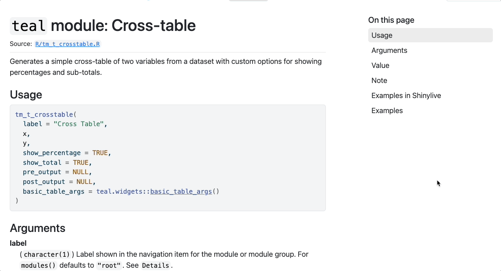
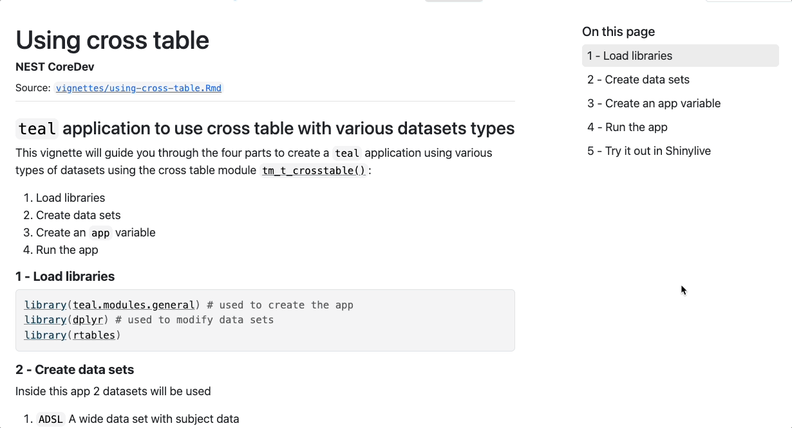

# roxy.shinylive

## Overview

This package provides a `roxygen2` extension that automatically takes the code from the `@examples` tag that follows and crate an URL to the shinylive service. During the documentation build, a new section is added to the function manual that contains aforementioned link as well as iframe to the application itself.

## Install

```r
# install.packages("pak")
pak::pak("insightsengineering/roxy.shinylive")
```

## Usage

### Creating a URL manually

```r
code <- "\"Hello World\""
roxy.shinylive::create_shinylive_url(code, mode = "editor")
```

This returns the following URL:

<https://shinylive.io/r/editor/#code=NobwRAdghgtgpmAXGKAHVA6ASmANGAYwHsIAXOMpMAHTAAk4AbRogAgHUiAnRgE1rABfALpA>

### In the roxygen2 documentation

In your `DESCRIPTION` file, add the following:

```yaml
Roxygen: list(..., packages = c(..., "roxy.shinylive"))
```

Then in your package documentation:

```r
#' (docs)
#' @examplesShinylive
#' @examples
#' (example code with a Shiny app)
```

Which would produce a following output in your documentation:

```Rd
\section{Examples in Shinylive}{
\describe{
  \item{example-1}{
    \href{https://shinylive.io/r/app/#code=...}{Open in Shinylive}
    \if{html}{\out{<script type="text/javascript">(custom JS)</script>}}
    \if{html}{\out{<iframe src="https://shinylive.io/r/app/#code=..."></iframe>}}
  }
  \item{example-2}{
    \href{https://shinylive.io/r/app/#code=...}{Open in Shinylive}
    \if{html}{\out{<script type="text/javascript">(custom JS)</script>}}
    \if{html}{\out{<iframe src="https://shinylive.io/r/app/#code=..."></iframe>}}
  }
  ...
}
}
```



### In the vignettes

In your `DESCRIPTION` file, add the following:

```yaml
Suggests:
  roxy.shinylive
```

Then in your vignette:

````Rmd
```{r shinylive_url, echo = FALSE, results = 'asis'}
# extract the code from knitr code chunks by ID
code <- paste0(c(
  ... # add more IDs if needed
  knitr::knit_code$get("app"),
  knitr::knit_code$get("shinyapp")
), collapse = "\n")

url <- roxy.shinylive::create_shinylive_url(code)
cat(sprintf("[Open in Shinylive](%s)\n\n", url))
```

```{r shinylive_iframe, echo = FALSE, out.width = '150%', out.extra = 'style = "position: relative; z-index:1"', eval = knitr::is_html_output() && identical(Sys.getenv("IN_PKGDOWN"), "true")}
knitr::include_url(url, height = "800px")
```
````



See the package documentation for more details.

See the example implementation in the [`teal.modules.general`](https://insightsengineering.github.io/teal.modules.general/) or [`teal.modules.clinical`](https://insightsengineering.github.io/teal.modules.clinical/) packages.
